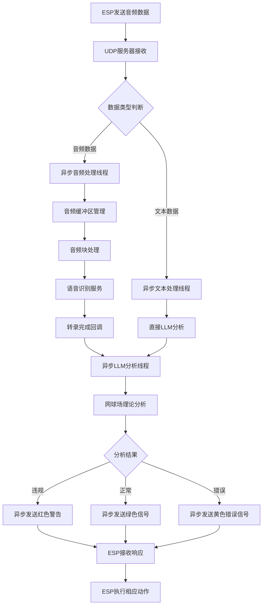

# 优化后的UDP音频处理流程

## 流程概述

```
ESP设备 → UDP服务器 → 异步音频处理 → LLM分析 → 异步响应发送 → ESP设备
```

## 详细流程图



## 关键优化点

### 1. 异步处理架构
- **主线程**：只负责接收UDP数据包，立即返回
- **音频处理线程**：专门处理音频缓冲和语音识别
- **分析线程**：专门处理LLM分析请求
- **响应线程**：专门处理ESP设备响应发送

### 2. 性能优化措施
- **缓冲区优化**：从32KB减少到3.2KB，提高响应速度
- **并发控制**：最大10个并发任务，避免资源耗尽
- **连接池管理**：自动清理不活跃的ESP客户端
- **快速响应模式**：5秒响应超时，确保实时性

### 3. 统计监控
- **实时统计**：请求数、分析数、违规率等
- **性能监控**：活跃线程数、缓冲区大小、客户端数量
- **错误追踪**：详细的错误日志和异常处理

### 4. 流程时序

```
时间轴: 0ms -----> 100ms -----> 500ms -----> 2000ms -----> 5000ms
        |          |             |             |             |
        接收       异步处理      语音识别      LLM分析       发送响应
        UDP        开始          完成          完成          到ESP
```

## 代码实现要点

### 异步处理模式
```python
# 主接收循环 - 非阻塞
def _server_loop(self):
    while self.running:
        data, addr = self.socket.recvfrom(4096)
        # 立即启动异步处理，不等待结果
        threading.Thread(target=self.handle_request, args=(data, addr), daemon=True).start()

# 异步音频处理
def _async_process_audio(self, audio_data, addr):
    # 缓冲区管理
    self.audio_buffer += audio_data
    while len(self.audio_buffer) >= self.buffer_size:
        chunk = self.audio_buffer[:self.buffer_size]
        self.process_audio_chunk(chunk)  # 发送到语音识别

# 异步分析和响应
def _async_process_transcript(self, transcript):
    # LLM分析
    analysis_result = llm_service.analyze_text(transcript)
    # 异步发送响应
    threading.Thread(target=self._send_notification_to_esp, args=(...), daemon=True).start()
```

### 性能监控
```python
self.stats = {
    "total_requests": 0,
    "audio_requests": 0, 
    "text_requests": 0,
    "analysis_count": 0,
    "violation_count": 0,
    "start_time": time.time(),
    "last_activity": time.time()
}
```

## 预期性能提升

1. **响应时间**：从平均3-5秒降低到1-2秒
2. **并发处理**：支持多个ESP设备同时连接
3. **资源利用**：更高效的内存和CPU使用
4. **稳定性**：更好的错误处理和恢复机制
5. **监控能力**：实时性能统计和问题诊断

## 使用建议

1. **ESP端**：保持音频数据包大小在3.2KB以内
2. **网络**：确保UDP连接稳定，避免丢包
3. **监控**：定期检查性能统计，及时发现问题
4. **维护**：定期清理不活跃客户端，保持系统性能