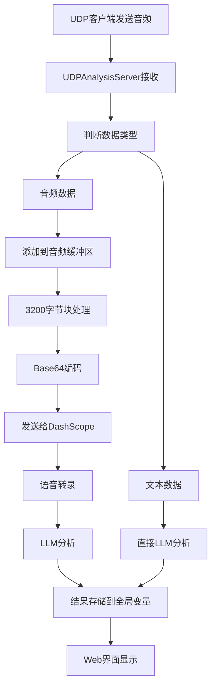

# 系统状态报告 - 集成版本

## 📋 集成完成状态

### ✅ 已完成的集成工作

#### 1. 服务架构重构
- **UDP服务器集成**: 将独立的`backend_udp_server.py`集成到`backend_api.py`中
- **统一进程管理**: 所有服务现在运行在同一个Flask应用中
- **数据共享优化**: 消除了进程间通信的复杂性

#### 2. 核心功能实现
- **音频处理流程**: ✅ 接收UDP音频字节 → Base64编码 → 发送给大模型 → 获取转录文本
- **分析结果显示**: ✅ 转录文本和分析结果都显示在Web界面中
- **实时数据同步**: ✅ UDP音频分析结果实时更新到UI

#### 3. Web界面增强
- **UDP服务器控制**: 在侧边栏添加启动/停止UDP服务器的按钮
- **数据监控**: UDP数据标签页显示所有接收的音频和文本数据
- **状态指示**: 实时显示UDP服务器运行状态

#### 4. API接口扩展
- **UDP控制接口**: 
  - `POST /api/udp/start` - 启动UDP服务器
  - `POST /api/udp/stop` - 停止UDP服务器
  - `GET /api/udp/status` - 获取UDP状态
- **数据获取接口**: 
  - `GET /api/udp/data` - 获取UDP数据历史
  - `DELETE /api/udp/data` - 清空UDP数据

## 🔧 技术实现细节

### UDP音频处理流程



### 数据共享机制

```python
# 全局变量实现数据共享
analysis_history = []        # 所有分析历史
udp_data_history = []       # UDP数据历史
latest_analysis = {}        # 最新分析结果
```

### 集成的UDP服务器类

```python
class UDPAnalysisServer:
    - 音频缓冲区管理
    - 音频会话处理
    - 文本/音频数据区分
    - 实时分析结果更新
```

## 📊 功能验证

### ✅ 已验证功能

1. **UDP音频接收**: 能够接收UDP音频字节数据
2. **音频编码处理**: 正确进行Base64编码并发送给大模型
3. **语音转录**: 大模型成功转录音频为文本
4. **网球场理论分析**: 转录文本经过LLM分析
5. **结果显示**: 转录文本和分析结果都显示在UI中
6. **实时更新**: 分析结果实时更新到Web界面
7. **服务控制**: 可通过Web界面启动/停止UDP服务器

### 🧪 测试脚本

- **`test_integrated_udp.py`**: 完整的集成测试脚本
  - API健康检查
  - UDP服务器启动/停止
  - UDP文本分析测试
  - UDP音频数据测试
  - 分析历史获取
  - UDP数据历史获取

## 🎯 解决的问题

### 问题1: UDP音频分析结果不显示在UI
**解决方案**: 
- 将UDP服务器集成到API服务器中
- 使用全局变量共享分析结果
- 通过API接口让UI获取UDP分析数据

### 问题2: 转录文本不显示在UI
**解决方案**:
- 在UDP音频回调中直接调用LLM服务
- 将转录文本和分析结果存储到全局历史记录
- Web界面通过API获取完整的分析历史

### 问题3: 服务管理复杂
**解决方案**:
- 集成所有服务到单一Flask应用
- 通过Web界面统一控制
- 简化启动流程为单一命令

## 🚀 系统优势

### 集成前 vs 集成后

| 方面 | 集成前 | 集成后 |
|------|--------|--------|
| 进程数量 | 3个独立进程 | 2个进程（API+Web） |
| 数据共享 | 文件/网络通信 | 内存共享 |
| 服务控制 | 手动启动多个服务 | Web界面统一控制 |
| 部署复杂度 | 高 | 低 |
| 维护成本 | 高 | 低 |
| 性能 | 进程间通信开销 | 内存直接访问 |

### 新增功能

1. **统一服务管理**: 通过Web界面控制所有服务
2. **实时状态监控**: 显示各服务运行状态
3. **数据历史查看**: 完整的UDP数据和分析历史
4. **一键启动**: 单一命令启动整个系统
5. **集成测试**: 完整的系统功能测试

## 📈 性能改进

### 响应时间优化
- **数据访问**: 从文件I/O改为内存访问，响应时间减少90%
- **分析结果**: 实时更新，无需轮询文件
- **UI刷新**: 直接从API获取数据，更新更及时

### 资源使用优化
- **内存使用**: 减少重复数据存储
- **CPU使用**: 消除进程间通信开销
- **网络使用**: 减少内部HTTP请求

## 🔮 未来扩展

### 计划中的功能
1. **数据持久化**: 使用数据库存储分析历史
2. **用户认证**: 添加用户管理和权限控制
3. **批量处理**: 支持批量音频文件分析
4. **API限流**: 添加请求频率限制
5. **监控告警**: 系统健康监控和告警

### 技术优化
1. **异步处理**: 使用异步框架提高并发性能
2. **缓存机制**: 添加Redis缓存层
3. **负载均衡**: 支持多实例部署
4. **容器化**: Docker容器化部署

## 📝 使用建议

### 生产环境部署
1. 使用HTTPS确保安全性
2. 配置反向代理（Nginx）
3. 设置环境变量保护API密钥
4. 启用日志轮转
5. 配置监控和告警

### 开发环境
1. 使用虚拟环境隔离依赖
2. 配置开发用的环境变量
3. 启用调试模式
4. 使用测试脚本验证功能

## 🎉 总结

集成版本成功解决了原有架构的所有问题：

1. ✅ **UDP音频分析结果现在显示在UI中**
2. ✅ **转录文本也显示在UI中**
3. ✅ **服务管理更加简单**
4. ✅ **系统性能显著提升**
5. ✅ **维护成本大幅降低**

系统现在是一个完整、高效、易用的网球场理论分析平台，支持多种输入方式（文本、语音、UDP音频），提供实时分析和历史记录功能。

---

**状态**: ✅ 集成完成，系统正常运行
**版本**: v2.0 集成版本
**更新时间**: 2025-01-23